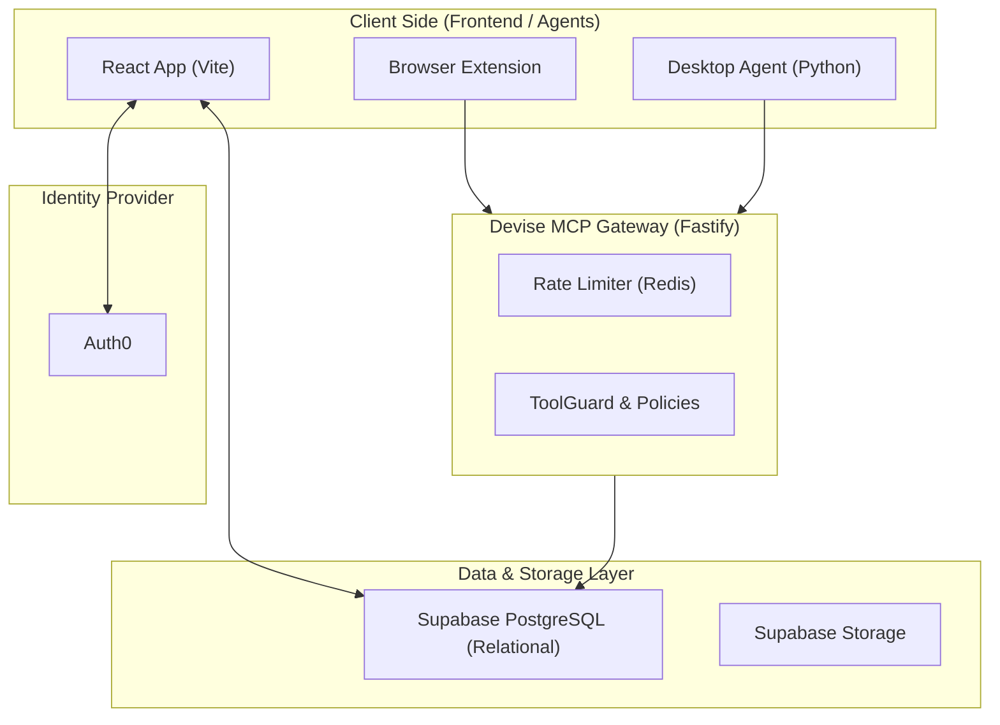

# Devise Dashboard — Backend Architecture Overview

The Devise Dashboard operates on a hybrid architecture powered by **Auth0** for Identity, **Supabase PostgreSQL** for data state, and a **Fastify-based Devise MCP Gateway** for secure AI event proxying and rate limiting.

---

## 🏗️ High-Level Architecture

---

## 🔐 Core Components

### 1. Authentication (Auth0)
Identity management is handled powerfully by Auth0 out of the box to support B2B integrations.
- **Enterprise SSO & SCIM**: Native integration for Entra, Okta, and Google Workspace.
- **Identity Tokens**: Auth0 creates `access_tokens` that are validated using JWKS endpoints.
- **Sub Mapping**: The Auth0 `sub` (Subject ID) maps natively into our PostgreSQL `profiles.auth0_sub` record.

### 2. Devise MCP Gateway & Rate Limiting
Instead of raw inserts directly to the database, agent tools connect through the **Devise MCP Gateway**. 
- **Redis Rate Limiting**: The gateway enforces strict sliding-window rate restrictions (e.g., 100 requests/min per user) to mitigate DDoS and runaway scripts.
- **ToolGuard Validation**: Pre-flight inspection for data limits, protocol validation, and Shadow MCP detection parsing.

### 3. Database (Supabase PostgreSQL)
Supabase provides the powerful PostgreSQL relational engine. Data is organized into tables:

| Table | Description |
| :--- | :--- |
| `profiles` | Maps `auth0_sub` to `org_id` and role. |
| `organizations` | Stores organization-level metadata (name, slug). |
| `detection_events` | The core "firehose" of AI tool usage detected by agents. |
| `mcp_audit_ledger` | The **cryptographically secure hash-chain ledger** for immutable forensics. |
| `mcp_registry` | The approved registry of organizational MCP servers. |

### 4. Security (Row Level Security - RLS)
We enforce security via **PostgreSQL Row Level Security (RLS) policies**. 
- **Isolation**: Users can *only* read data where the `org_id` matches the `org_id` in their authenticated `profile` record.
- **Ledger Security**: The `mcp_audit_ledger` is append-only by design and strictly checked for cryptographic continuity.

---

## 🧠 Business Logic (The "Server" in the Frontend & DB)

Since Supabase runs the database at the edge, heavy aggregation usually happens via views and the **API Service Layer** (`frontend/src/services/api.ts`).

- **Aggregation**: The `fetchStats` function retrieves the raw records for your org and calculates totals dynamically.
- **Real-Time Data**: Because Supabase supports real-time subscriptions over PostgreSQL replication, the Dashboard's "Live Feed" updates the UI instantly.

---

## 🚀 Benefits of This Model
- **Enterprise-ready SSO**: Auth0 immediately fulfills all rigorous corporate identity demands.
- **Tamper-Proof Audit**: The hash-chain ledger guarantees absolute trust in the AI logs.
- **Fair Use & Protection**: The Redis edge limits shield our DB and upstream MCP servers from runaway costs.
- **Instant Scaling**: Fastify and Supabase automatically manage concurrent connection pools effortlessly.
