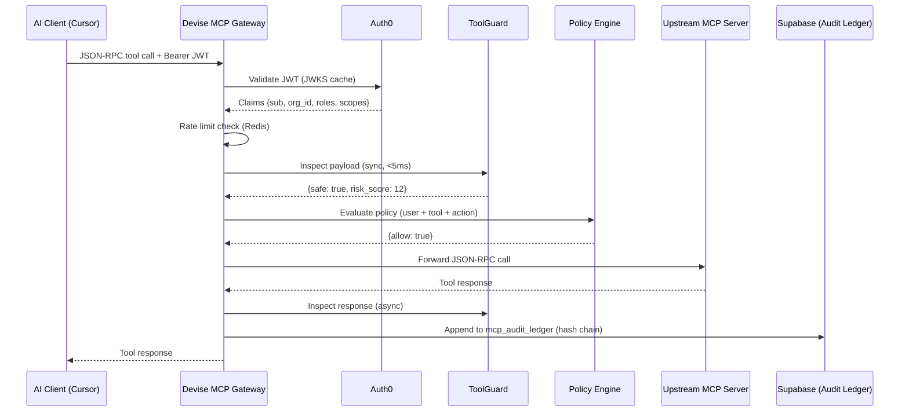

# Devise MCP Servers (Runlayer Strategy) & Full Architecture

This document outlines the architectural plan for introducing built-in, managed Model Context Protocol (MCP) servers within the Devise ecosystem, drawing inspiration from Runlayer. It ensures high-security, transparent, and auditable AI tool execution.

## The Devise MCP Gateway Architecture

To support managed MCP servers robustly, we use a centralized **Devise MCP Gateway**, implemented in Node.js (Fastify) and deployed as a fast reverse proxy. Client applications connect strictly through our gateway, completely bypassing unmanaged external tool servers.

---

## 1. Auth & Rate Limiting

### Auth0 Enterprise Authentication
We use **Auth0** to provide true B2B SSO (Okta, Entra, SCIM) and RBAC capabilities. The Devise MCP Gateway acts as a Resource Server validating Auth0 Machine-to-Machine (M2M) backend tokens or user-issued JWTs. 

### Three-Layer Rate Limiting
To ensure fair use and prevent runaway agent loops:
1. **Edge Limiting (Fastify + Redis):** Limits at 100 calls/min per user and 5,000 calls/min per organization using a sliding window.
2. **Database Limiting:** Supabase connection pooling protects the backend from spikes.
3. **Agent Throttling:** Desktop/browser agents respect an exponential backoff on HTTP 429 Too Many Requests responses.

---

## 2. Enterprise Threat Detection ("ToolGuard")

A multi-tier detection system sitting at the gateway edge:
* **Pre-execution Inspector (Sync, <5ms):** Scans the JSON-RPC payload for command execution characters and prompt injection signatures.
* **Tool Poisoning Detector (Sync, <2ms):** Verifies the server provides exactly its declared metadata.
* **PII & Leak Scanner (Async, ~50ms):** Employs lightweight deterministic models to scan the Tool Response for SSNs, creds, and sensitive keys.
* **Rug-Pull Detection (Async):** Looks at behavioral baselines.

---

## 3. Blockchain-Based Tamper-Proof Audit Ledger

For true indisputable observability, our Supabase backend utilizes a **Merkle hash chain** inside PostgreSQL table `mcp_audit_ledger` to record MCP events.

* **Hash-Chaining:** Each new row includes a `prev_hash` computed from the previous row’s SHA-256 signature, cryptographically linking the entire event history of the organization.
* **Integrity Proofs:** Any modification to a historical event breaks the chain immediately. Weekly or daily root hashes provide verification anchors.
* **Dashboard Verification:** The frontend directly requests chain integrity scores from the backend.

---

## 4. "Shadow MCP" Detection

To capture unmanaged bypasses:
* **Local Traffic Verification:** The Devise desktop agent utilizes `psutil` and network analysis to map active connections doing JSON-RPC 2.0 streaming.
* **Alert Resolution:** Checks active endpoints against the approved org database (`mcp_registry`). Any unregistered connection pipe generates an immediate alert to `detection_events` with the source process (e.g., `Cursor.exe` connected to unexpected port `3050`).

---

## 5. Private MCP Registry

An organizational allowlist registry (`mcp_registry`) containing:
* Approved servers, endpoints, transport modes (SSE/HTTP), and version hashes.
* Single-click installations for developers ensuring they route directly through the Devise Gateway context.

